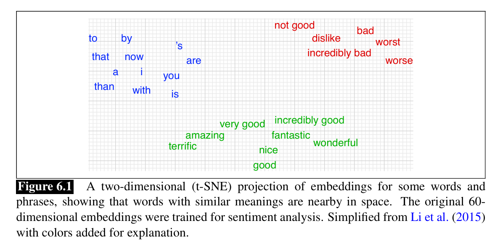
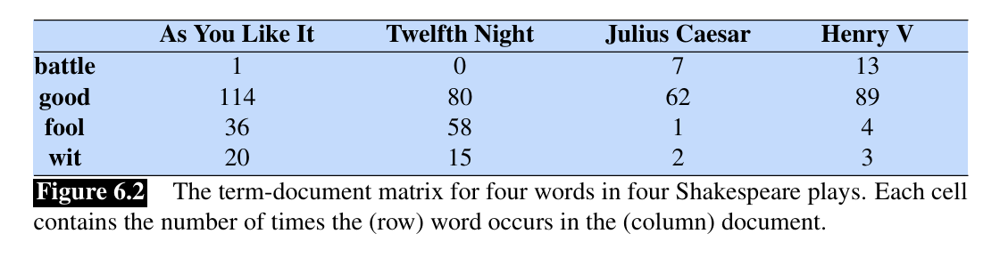
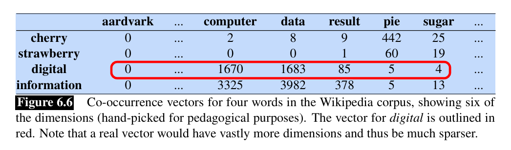

## Summary of Chapter 6: Vector Semantics and Embeddings

This chapter introduces **vector semantics**, a powerful approach in NLP for representing word meaning using vectors (also called **embeddings**) derived from their distributional properties in text corpora. It moves beyond simple string representations to capture nuances like similarity, relatedness, and connotation.

### 6.1 Lexical Semantics

*   **Focus:** Traditional linguistic study of word meaning.
*   **Key Concepts:**
    *   **Lemma / Citation Form:** The dictionary headword (e.g., `mouse`, `sing`).
    *   **Wordform:** The inflected or surface form (e.g., `mice`, `sung`).
    *   **Sense:** A discrete meaning of a polysemous lemma (e.g., `mouse` the rodent vs. `mouse` the device).
    *   **Synonymy:** Words/senses with identical or near-identical meanings (e.g., `sofa`/`couch`). Exact synonymy is rare (**Principle of Contrast**).
    *   **Similarity:** A measure of how alike two words are (e.g., `cat` is similar to `dog`). Graded, unlike synonymy.
    *   **Relatedness / Association:** How connected two words are, often through events or scenarios (e.g., `coffee` and `cup` are related but not similar).
    *   **Semantic Field:** A group of words covering a specific domain (e.g., hospitals: `surgeon`, `scalpel`, `nurse`). Related to **topic models**.
    *   **Semantic Frame:** Words denoting perspectives/participants in an event type (e.g., Commercial Transaction frame with roles like Buyer, Seller, Goods).
    *   **Connotation / Affective Meaning:** Emotional/evaluative aspect of meaning. Key dimensions identified by Osgood include:
        *   **Valence:** Pleasantness (positive/negative).
        *   **Arousal:** Intensity/activation.
        *   **Dominance:** Degree of control.
*   **Limitation:** Traditional representations (like just capitalizing words) are insufficient for capturing these complex relationships.

### 6.2 Vector Semantics

*   **Core Idea:** Represent word meaning as a **vector** (a point) in a multi-dimensional space. This vector is called an **embedding**.
* The word “embedding” derives from its mathematical sense as a mapping from one space or structure to another, although the meaning has shifted.
*   **Foundation:** Based on the **distributional hypothesis**: words that occur in similar contexts tend to have similar meanings.
*   **Origin:** Combines linguistic distributional ideas (Harris, Firth) with psychological models of meaning as points in space (Osgood).
*   **Example**: Suppose you dont know the meaning of the word 'ongchoi' but you see it in the contexts:
    *   Ongchoi is delicious sauteed with garlic
    *   Ongchoi is superb over rice
    
    And suppose you had seen many of these context words in other contexts:
    * ...spinach sauteed with garlic over rice...
    * ...chard stems and leaves are delicious...
* The fact that ongchoi occurs with words like rice and garlic and delicious and salty, as do words like spinach, chard, and collard greens might suggest that ongchoi is a leafy green similar to these other leafy greens. We can do the same thing computationally by counting words in the contexts of *ongchoi*

* NLP applications like the sentiment classifiers depend on the same words appearing in the training and test sets. But by representing words as embeddings, a classifier can assign sentiment as long as it sees some words with similar meanings. And as we’ll see, vector semantic models can be learned automatically from text without supervision.

### 6.3 Words and Vectors

*   **Method:** Vector models are generally based on **co-occurrence matrices**.
*   **6.3.1 Vectors and documents:**
    *   Introduces the **term-document matrix**. Rows are words (terms), columns are documents. Cells contain counts (how often a word occurs in a document).
    
    *   A document is represented as a **column vector** (its counts for all words).
    *   Similar documents have similar vectors (because they share words). Used in Information Retrieval (IR).
    *   Information retrieval is the task of finding the document d from the D documents in some collection that best matches a query q. For IR we’ll therefore also represent a query by a vector, also of length |V|,
*   **6.3.2 Words as vectors: document dimensions:**
    *   A word can be represented as a **row vector** from the term-document matrix.
    *   Its dimensions correspond to the documents it appears in.
    *   Similar words appear in similar documents, so their vectors are similar.
*   **6.3.3 Words as vectors: word dimensions:**
    *   Introduces the **term-term matrix** (word-word or term-context matrix). Rows are target words, columns are context words. Cells contain co-occurrence counts within a defined context window (e.g., ±4 words).
        *  is traditionally followed by **cherry** pie, a traditional dessert
        *  often mixed, such as **strawberry** rhubarb pie. Apple pie
        *  computer peripherals and personal **digital** assistants. These devices usually 
        *  a computer. This includes **information** available on the internet
        
    *   A word is represented as a **row vector**. Its dimensions correspond to its context words.
    *   Vectors are typically **high-dimensional** (vocabulary size, 10k-50k+) and **sparse** (most entries are zero).

### 6.4 Cosine for measuring similarity

*   **Problem:** Need a metric to measure similarity between two word vectors **v** and **w**.
*   **Dot Product:** A simple measure (`v · w`), high when vectors have large values in the same dimensions.
    *   **Limitation:** Favors long vectors (frequent words).
*   **Cosine Similarity:** The standard metric. Calculates the cosine of the angle between the two vectors.
    *   **Formula:** `cosine(v, w) = (v · w) / (|v| |w|)`
    *   Normalizes for vector length, making it insensitive to word frequency effects.
    *   Ranges from 0 (orthogonal/dissimilar) to 1 (identical direction/similar) for non-negative counts. Can range to -1 if vectors have negative values.
    *   Can be computed efficiently as the dot product of **unit vectors**.
* **Example**:

|               | **pie** | **data** | **computer** |
|:--------------|--------:|---------:|-------------:|
| **cherry**    | 442     | 8        | 2            |
| **digital**   | 5       | 1683     | 1670         |
| **information** | 5       | 3982     | 3325       |

cos(cherry, information) = $\frac{442 \cdot 5 + 8 \cdot 3982 + 2 \cdot 3325}{\sqrt{442^2 + 8^2 + 2^2} \cdot \sqrt{5^2 + 3982^2 + 3325^2}} = 0.018$

cos(digital, information) = $\frac{5 \cdot 5 + 1683 \cdot 3982 + 1670 \cdot 3325}{\sqrt{5^2 + 1683^2 + 1670^2} \cdot \sqrt{5^2 + 3982^2 + 3325^2}} = 0.996$

### 6.5 TF-IDF: Weighing terms in the vector

*   **Problem:** Raw frequency counts are not optimal; common words (like `the`) are frequent but not discriminative. Need to balance term frequency with term distinctiveness.
*   **TF-IDF Weighting:** Used primarily for **term-document matrices**.
    *   **Term Frequency (tf):** Measures how often term `t` occurs in document `d`. Usually log-weighted (`1 + log10(count)`) to dampen effect of high counts. `tf(t,d) = 0` if count is 0.
    *   **Inverse Document Frequency (idf):** Measures how informative a term `t` is. $idf_t = \log_{10}(\frac{N}{df_t})$, where $N$ is total documents and $df_t$ is document frequency of `t`. Gives higher weight to rarer terms. Words occurring in all documents have idf = 0.
    *   **TF-IDF:** The product $tf-idf_{t,d} = w_{t,d} = \text{tf}_{t,d} \cdot \text{idf}_t$.
*   **Result:** Downweights frequent-but-common words, upweights frequent-and-distinctive words.

### 6.6 Pointwise Mutual Information (PMI)

*   **Purpose:** An alternative weighting scheme, primarily used for **term-term matrices**.
*   **Intuition:** Measures how much more two words (`w` and `c`) co-occur than expected by chance if they were independent.
*   **Formula:** `PMI(w, c) = log2 ( P(w, c) / (P(w) * P(c)) )`
*   **Positive PMI (PPMI):** Commonly used variant where negative PMI values are replaced with 0. `PPMI(w, c) = max(PMI(w, c), 0)`. Addresses unreliability of negative PMI and log(0) issue.
*   **Bias:** PMI/PPMI can be biased towards infrequent words/events.
*   **Fixes:** Weighting context probabilities (`Pα(c)`) or using add-k smoothing can mitigate low-frequency bias.

### 6.7 Applications of the tf-idf or PPMI vector models

*   **Summary:** These models represent words as sparse vectors based on co-occurrence counts, weighted by tf-idf or PPMI.
*   **Similarity:** Word similarity is computed using the **cosine** of their vectors.
*   **Document Representation:** A document can be represented by the **centroid** (average) of the vectors of the words it contains. Document similarity is computed via cosine of centroids.
*   **Applications:** Used for finding similar words/documents, information retrieval, paraphrase detection, etc.

### 6.8 Word2vec

*   **Shift:** Moves from long, sparse vectors (tf-idf, PPMI) to short, **dense embeddings**. Dimensions range 50-1000, values are real numbers (can be negative).
*   **Advantages:** Dense vectors generally perform better in NLP tasks (better generalization, capture synonymy better).
*   **Word2vec:** A specific toolkit/set of algorithms for learning dense embeddings. Focuses on **skip-gram with negative sampling (SGNS)**.
*   **Static Embeddings:** Word2vec learns one fixed embedding per word type.
*   **6.8.1 The classifier:**
    *   **Core Idea:** Instead of counting co-occurrences, train a classifier to predict: "Is word `c` likely to appear near target word `w`?". The learned weights become the embeddings.
    *   **Method:** Uses logistic regression (sigmoid function) applied to the dot product of the target word embedding `w` and a candidate context word embedding `c`. `P(+|w, c) = σ(c · w)`.
    *   **Two Embedding Matrices:** Learns two sets of embeddings per word: one as a target (`W`), one as a context (`C`).
*   **6.8.2 Learning skip-gram embeddings:**
    *   **Self-supervision:** Uses running text as implicit supervision.
    *   **Positive Examples:** Pairs of (target word `w`, actual context word `cpos`).
    *   **Negative Examples:** Pairs of (target word `w`, noise word `cneg`). Noise words are sampled randomly based on their weighted unigram frequency (`pα(w)` with `α=0.75`), biasing slightly towards rarer words. More negative examples (`k`) are used per positive example.
    *   **Objective:** Adjust embeddings (using SGD) to maximize similarity (dot product) for positive pairs and minimize similarity for negative pairs.
    *   **Final Embedding:** Often use `W` matrix, or sum/average `W` and `C` embeddings for each word.
*   **6.8.3 Other kinds of static embeddings:**
    *   **fastText:** Extension of word2vec using *subword* models (n-grams of characters). Helps handle unknown words and morphology.
    *   **GloVe:** Another popular method based on ratios of co-occurrence probabilities, connecting count-based (like PPMI) and prediction-based (like word2vec) methods.

### 6.9 Visualizing Embeddings

*   **Purpose:** Understand the high-dimensional embedding space.
*   **Methods:**
    *   **Nearest Neighbors:** List words with the highest cosine similarity to a target word.
    *   **Clustering:** Use hierarchical clustering to show relationships.
    *   **Dimensionality Reduction:** Project high-dimensional vectors (e.g., 100-300D) down to 2D for plotting, using techniques like **t-SNE**.

### 6.10 Semantic properties of embeddings

*   **Context Window Size:** Affects the type of similarity captured. Shorter windows (±1-2 words) yield more syntactic/similar-POS neighbors. Longer windows (±5-10 words) yield more topically related neighbors.
*   **First-order vs. Second-order Co-occurrence:** First-order means words occur near each other (e.g., `wrote`, `book`). Second-order means words share similar neighbors (e.g., `wrote`, `said`). Embeddings capture second-order co-occurrence well.
*   **Analogy / Relational Similarity:** Dense embeddings capture relational similarities, solvable via the **parallelogram model** (vector offsets).
    *   Example: `vector(king) - vector(man) + vector(woman)` results in a vector close to `vector(queen)`.
    *   **Caveats:** Doesn't always work perfectly, often returns input words, better for frequent words/certain relations.
*   **6.10.1 Embeddings and Historical Semantics:** Embeddings trained on corpora from different time periods can reveal how word meanings have changed over time.

### 6.11 Bias and Embeddings

*   **Critical Issue:** Embeddings trained on human text data learn and **reproduce/amplify** societal biases (gender, race, etc.).
*   **Examples:** Stereotypical analogies (`man:programmer :: woman:homemaker`), different associations for names based on perceived race/gender.
*   **Harms:** Can lead to **allocational harms** (unfair resource distribution) and **representational harms** (demeaning social groups) when used in downstream systems.
*   **Debiasing:** An active research area focused on mitigating these learned biases, though complete elimination is challenging.

### 6.12 Evaluating Vector Models

*   **Extrinsic Evaluation:** Most important method. Measures performance improvement when embeddings are used in a downstream NLP task (e.g., sentiment analysis, parsing).
*   **Intrinsic Evaluation:** Measures quality based on direct tasks related to meaning.
    *   **Word Similarity:** Correlating model's cosine similarity scores with human ratings on datasets like WordSim-353, SimLex-999, SCWS, WiC.
    *   **Analogy Task:** Evaluating performance on solving analogy questions (`a:b :: a*:?`).

### 6.13 Summary

*   Recaps the core concepts: meaning as vectors (embeddings), sparse (tf-idf, PPMI) vs. dense (word2vec), cosine similarity, applications, and the critical issue of bias.